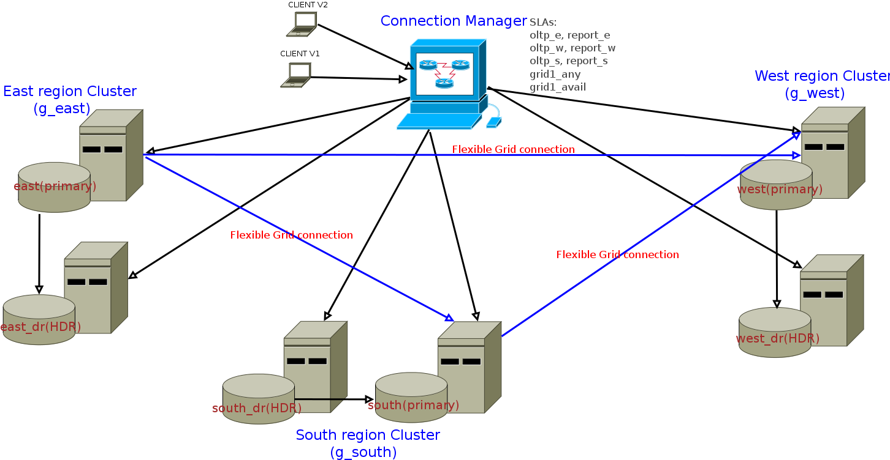

# informix-rolling-application-upgrade
Zero downtime rolling schema and application upgrade

This lab is based on docker images. 

Download and install docker : https://www.docker.com/get-docker

Copy Informix server tar file to server_ctx/iif.12.10.tar

Copy Informix Client SDS tar file to cm_ctx/clientsdk.4.10.tar

Run docker_refresh.sh command to build docker images for Informix server and connection manager. 

IMPORTANT NOTE: This script removes all existing DOCKER IMAGES and VOLUMES on the system. You may want to comment out 1) docker rmi -- deletes all images 2) docker volume rm -- deletes all volumnes. 

Run docker_run.sh to start dococker containers.

Follow instructions in rolling_schema_upgrade_instructions.pdf to go through the process of zero downtime upgrade for database schema and applications.

